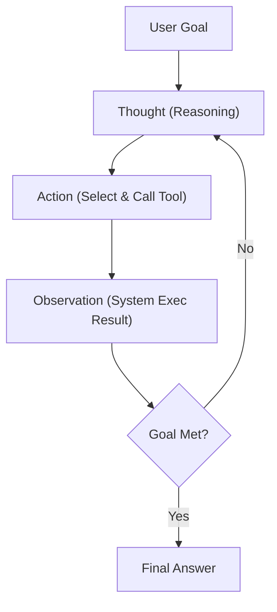

# Concept Notes: Module 02 - Core Agent Loop Mechanics

## The ReAct Framework (Reasoning & Acting)
Traditional APIs are linear. Autonomous agents operate in a dynamic cycle:
1. **Thought**: The model reasons about the state of the goal.
2. **Action**: The model chooses a tool and formats the input.
3. **Observation**: The system executes the tool and passes the raw outputs back to the prompt history.

## Failure Modes of Naive Loops
1. **Static Loops**: The LLM suggests the same tool with the exact same arguments repeatedly.
2. **Budget Leaks**: A loop that costs $0.05 per call can burn through thousands of dollars in hours if unchecked.
3. **Context Overflow**: Long loop histories exceed token capacity, crashing the execution.
