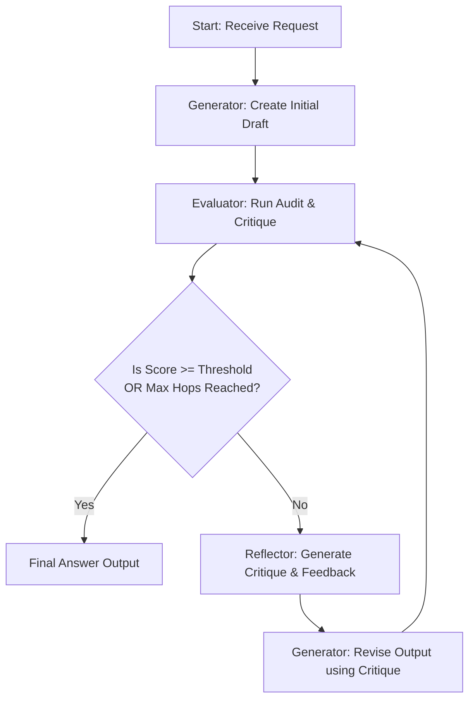

# Module 06: Supplementary Patterns Catalog

This catalog provides deep conceptual breakdowns and implementation details for the core agentic design patterns covered in this module: **ReAct (Reason + Action)**, **Self-Reflection**, **Planning**, and **Human-in-the-Loop (HITL)**.

---

## 1. ReAct Trace Anatomy
The **Reasoning + Action** (ReAct) paradigm interleaves thinking steps with action steps. This allows the model to perform dynamic reasoning, select tools, and incorporate environment observations into its context.

Below is the standard execution trace anatomy for a ReAct step:

```
+--------------------------------------------------------------------+
|                         [User Query]                               |
|            "Check status of order #90210 and refund"               |
+--------------------------------------------------------------------+
                                 |
                                 v
+--------------------------------------------------------------------+
| Thought 1: "I need to look up the order status of #90210 first.    |
|             I should call the get_order_status tool."              |
+--------------------------------------------------------------------+
                                 |
                                 v
+--------------------------------------------------------------------+
| Action 1:  get_order_status(order_id="90210")                      |
+--------------------------------------------------------------------+
                                 |
                                 v
+--------------------------------------------------------------------+
| Observation 1: {"status": "damaged_in_transit", "cost": 120.0}     |
+--------------------------------------------------------------------+
                                 |
                                 v
+--------------------------------------------------------------------+
| Thought 2: "The order is damaged in transit. I should initiate a  |
|             refund. Let's call the initiate_refund tool."           |
+--------------------------------------------------------------------+
                                 |
                                 v
+--------------------------------------------------------------------+
| Action 2:  initiate_refund(order_id="90210", amount=120.0)         |
+--------------------------------------------------------------------+
                                 |
                                 v
+--------------------------------------------------------------------+
| Observation 2: {"status": "pending_approval", "auth_required": true}|
+--------------------------------------------------------------------+
                                 |
                                 v
+--------------------------------------------------------------------+
| Thought 3: "The refund is pending approval. I should inform the    |
|             user and log the step."                                |
+--------------------------------------------------------------------+
                                 |
                                 v
+--------------------------------------------------------------------+
| Final Answer: "The refund of $120.0 for order #90210 has been      |
|                initiated and is pending approval."                 |
+--------------------------------------------------------------------+
```

### Key Rules for ReAct Traces
1. **Never skip thoughts**: The reasoning step anchors the model, reducing hallucinated tool arguments.
2. **Observe faithfully**: System-provided observation blocks must be separated clearly from the agent's generated tokens to prevent context contamination.

---

## 2. Reflection Loop Decision Tree
Self-Correction (or Reflection) loops run a Generator model to produce an initial output, followed by a Evaluator/Reflector model that scores and critiques the output. The loop repeats until the criteria are satisfied or the budget limit is reached.



### Decision Matrix for Loop Control

| Case | Check Result | Action | State Updates |
| :--- | :--- | :--- | :--- |
| **Success** | Score meets threshold | Exit Loop | Status: `SUCCESS` |
| **Max Iterations** | Hops count limit exceeded | Break Loop | Status: `MAX_HOPS_EXCEEDED` |
| **Token Cost Overflow** | Budget exceeded mid-loop | Immediate Halt | Status: `COST_LIMIT_BREACHED` |
| **Degraded Output** | Score is decreasing | Fallback / Rollback | Status: `FALLBACK_TRIGGERED` |

---

## 3. Planning Horizon Tradeoffs
Planning patterns split complex tasks into explicit steps (e.g. Sub-tasks) before executing them.

```
       +------------------+
       |   User Request   |
       +------------------+
                 |
                 v
       +------------------+
       |   Planner Model  |
       +------------------+
         /       |      \
        v        v       v
     [Step 1] [Step 2] [Step 3]
        |        |        |
        +--------+--------+---> Executor Agents
```

### Static vs. Dynamic Planning Horizons

| Feature | Static Plan-and-Solve | Dynamic Re-Planning |
| :--- | :--- | :--- |
| **Complexity** | Low (Single planning prompt) | High (Requires state loops after each tool call) |
| **Latency** | Low (Executes actions sequentially) | High (Refactor/re-plan on every observation) |
| **Reliability** | Medium (Fails if intermediate step breaks) | High (Recovers by adapting steps to errors) |
| **Best Used For** | Structured data pulls, report formats | Multi-system data migration, interactive debugging |

---

## 4. Human-in-the-Loop (HITL) Gate Schemas
A production-grade agent must not write to databases or issue transactions without structured safety gates. When a high-risk operation is requested, the agent creates a **Pending Approval** state, pausing execution until a human operator responds.

### State Transitions for Approval Gates

```
+------------+      Trigger High-Risk Action      +--------------------+
|  RUNNING   | --------------------------------> |  PENDING_APPROVAL  |
+------------+                                   +--------------------+
                                                            |
                                        +-------------------+-------------------+
                                        |                                       |
                                 Human Approves                         Human Rejects
                                        v                                       v
                             +--------------------+                  +--------------------+
                             |      APPROVED      |                  |      REJECTED      |
                             +--------------------+                  +--------------------+
```

### Example Structured Approval Payload
The request and response schemas are modeled using strict Pydantic structures to preserve state boundaries:

```json
{
  "gate_id": "gate_ref_88291",
  "action_type": "refund_initiate",
  "payload": {
    "order_id": "90210",
    "amount": 250.00,
    "currency": "USD"
  },
  "status": "PENDING_APPROVAL",
  "metadata": {
    "escalated_by": "supervisor_agent",
    "reason": "Transaction amount exceeds auto-approval threshold of $100.00"
  }
}
```
