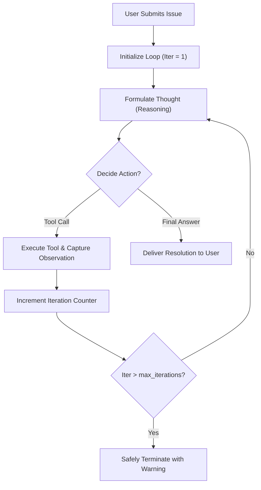
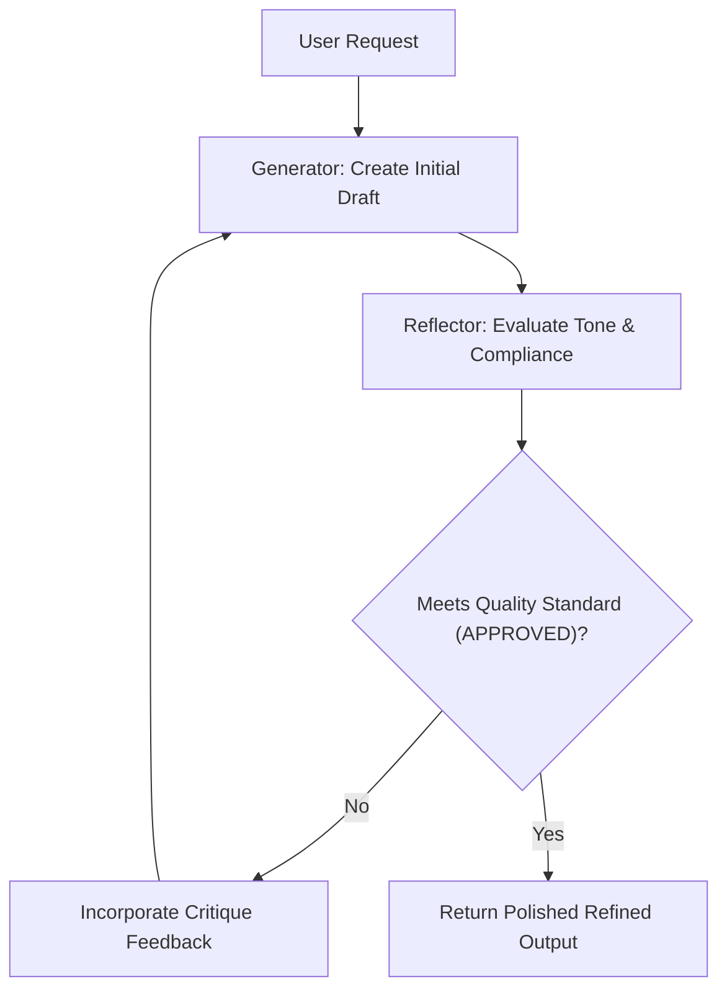
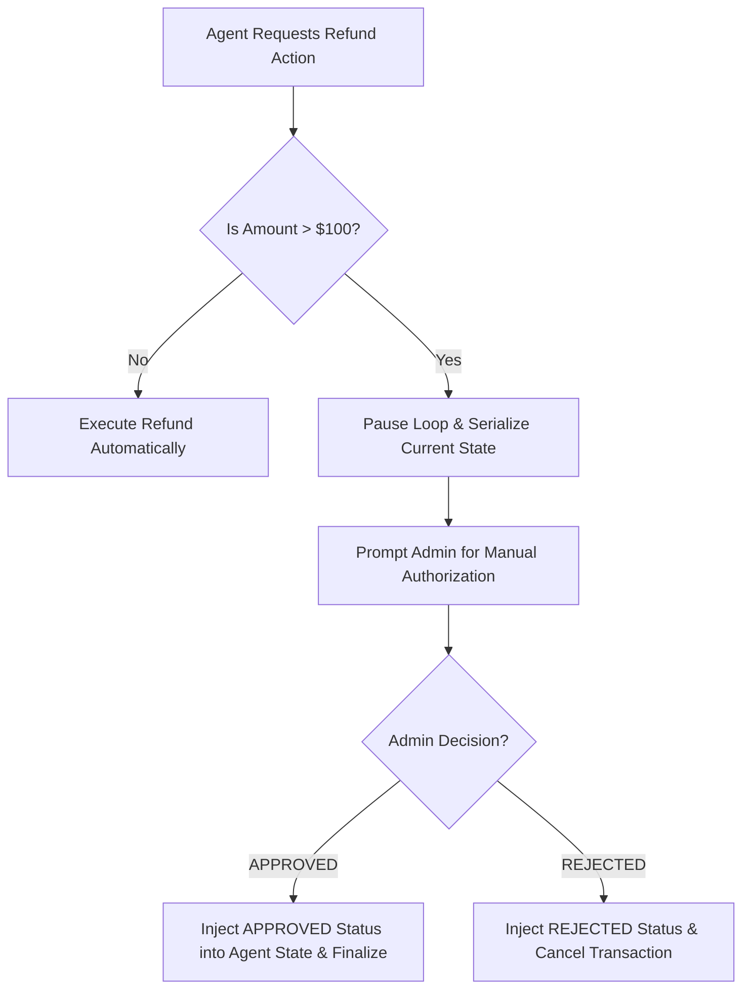

# Agent Patterns: Workflow Visualization Diagrams

These flowcharts outline the exact logical trajectories followed by single-agent patterns in this module.

---

## 1. ReAct Reasoning Cycle

---

## 2. Generator-Reflector Critique Cycle

---

## 3. Human-in-the-Loop (HITL) Security Gate

