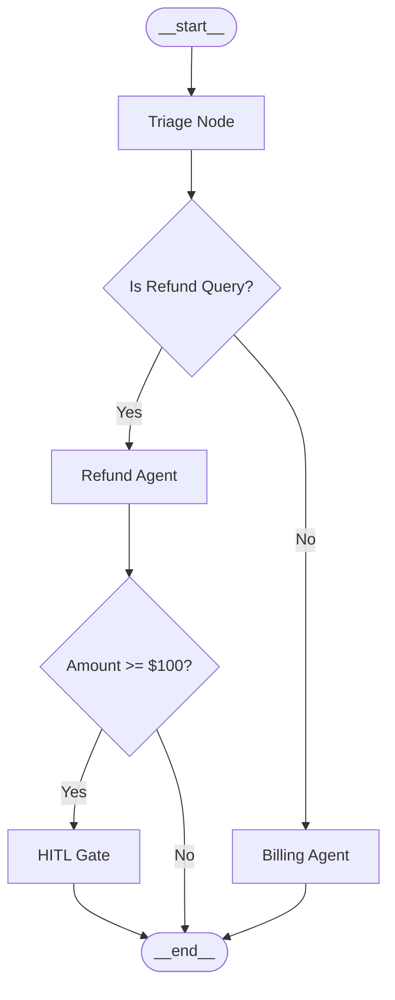

# Module 07: Multi-Agent Orchestration Patterns

This guide breaks down the core structural topologies and state handoff protocols used in multi-agent environments: **Supervisor → Worker**, **Event-Driven Handoffs (Choreography)**, and **Graph-Based Orchestration**.

---

## 1. Supervisor → Worker Topology
In a hierarchical or Supervisor-Worker setup, a central controller (the Supervisor) manages the conversation state, routes queries to specialist workers, and acts as the gatekeeper for user interaction.

```
                  +------------------+
                  |    Supervisor    | <=======> [User/Client]
                  +------------------+
                     /      |      \
         +----------+       |       +----------+
         |                  |                  |
         v                  v                  v
  +--------------+   +--------------+   +--------------+
  |  Billing     |   |  Refund      |   |  Triage      |
  |  Specialist  |   |  Specialist  |   |  Specialist  |
  +--------------+   +--------------+   +--------------+
```

### Protocol Mechanics
1. **Delegation**: The supervisor parses the user prompt, builds a payload conforming to the specialist's target contract, and yields execution.
2. **Specialist Autonomy**: The worker completes its specialized action, updates its local task outputs, and returns state to the supervisor.
3. **Consensus & Termination**: The supervisor evaluates the specialist's output and determines if the task is complete, needs further iteration, or requires routing to another specialist.

---

## 2. Event-Driven Handoffs (Choreography)
Unlike supervisor setups, choreographed networks lack a single central controller. Instead, agents cooperate by directly routing execution to other agents based on conditions, payloads, or events.

```
+--------------+    Handoff Event    +--------------+    Handoff Event    +--------------+
| Triage Agent | ------------------> | Billing Agent| ------------------> | Security Gate|
+--------------+                     +--------------+                     +--------------+
```

### When to Use Choreography vs. Supervision

| Feature | Supervisor-Worker (Orchestration) | Event-Driven Handoffs (Choreography) |
| :--- | :--- | :--- |
| **Control** | Centralized | Decentralized |
| **Complexity** | Low (Single agent directs traffic) | High (Requires shared event contracts) |
| **Flexibility** | Rigid (Changes require rebuilding the supervisor) | Fluid (New agents subscribe to existing event payloads) |
| **System State** | Single consolidated history context | Event bus or distributed payload array |

---

## 3. Graph-Based Execution Patterns
Industrial frameworks (such as LangGraph) represent multi-agent workflows as state graphs where:
* **Nodes**: Python functions representing agent steps or tool calls.
* **Edges**: Routing lines connecting nodes.
* **Conditional Edges**: Decision functions (routers) returning the next node key based on state parameters.
* **State**: A thread-safe, central dictionary or reducer that accumulates data.



### Designing Robust Graphs
1. **Loop Mitigations (Halt Limits)**: Always track the hop count inside the shared state. Trigger an escalation error if the number of hops exceeds a threshold (e.g. 3 hops) to avoid infinite ping-pong routing loops.
2. **Immutable Handoffs**: Use structured Pydantic models for edge transitions to guarantee type safety between node boundaries.
